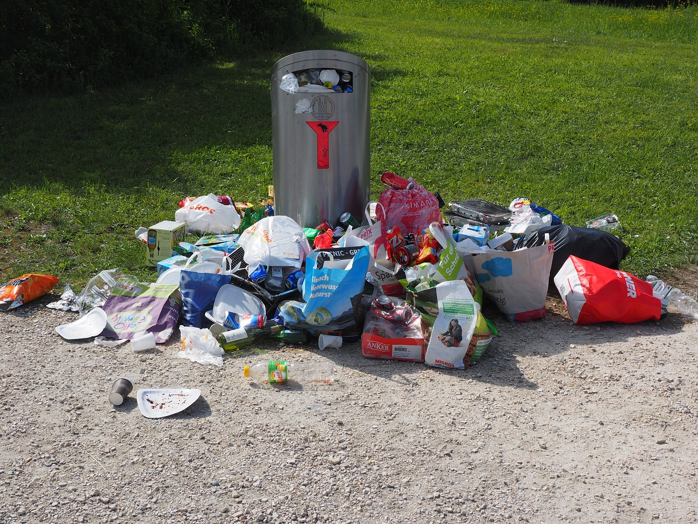

% The Scala programming ecosystem
% Leveraging functional, OO, libraries and frameworks
% Markus Dale, 2016

# Scala - The Bad and Ugly

# Scala - The Good

# The Scala Programming Language
* Martin Odersky, EPFL, Switzerland
     * Worked on javac (1.3)
     * Java Generics
* Lightbend (formerly Typesafe)
* Multi-paradigm language
     * Functional and Object-Oriented
* Statically typed
* Scalable language - script to large program
* Stretch your mind - functions and immutability

# Sca\(lable\) la\(nguage\)

* Apache Kafka (LinkedIn)
* Apache Spark (Databricks)
* Finagle (Twitter)
* Akka (Lightbend)
* Lucid Software - scala.js presentation
* Play Web Framework
     * [Lichess Online Chess](https://en.lichess.org/)
* Lightbend customers: Walmart, Verizon, Twitter, LinkedIn, Coursera, The Guardian, Airbnb...

# Scala to Java bytecode
* Leverage Java Virtual Machine (JVM)
     * Over 20 years of optimizations
     * Java Interpreter and Just-in-time (JIT) compilers
     * Portability and Security
     * Ever-evolving garbage collectors
* Full interoperability with Java and Java libraries

# Exploration - Scala Shell and Worksheet

# Scala Tour
* Conciseness

# scalatour/01-NoSemicolons.sc
* optional semicolons
* type inference
* vals vs. vars
* higher-order functions on collections

# Resources
* Coursera/EPFL [Functional Programming in Scala Specialization](https://www.coursera.org/specializations/scala)
* [Twitter Scala School](http://twitter.github.io/scala_school/)
