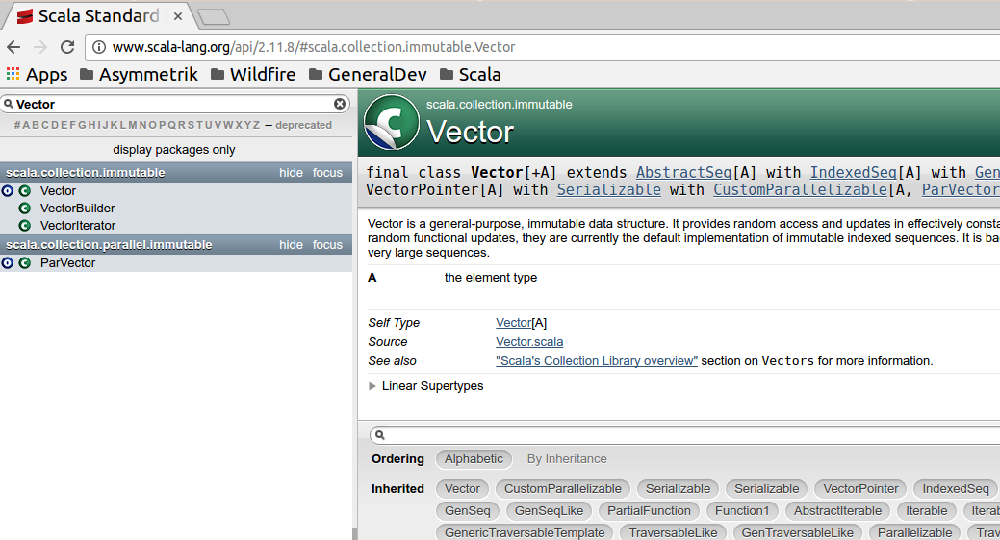

% The Scala programming ecosystem
% Leveraging functional, OO, libraries and frameworks
% Markus Dale, 2016

# Scala - The Good


# The Scala Programming Language
* Martin Odersky, EPFL, Switzerland
     * Worked on javac (1.3)
     * Java Generics
* Lightbend (formerly Typesafe)
* Multi-paradigm language
     * Functional and Object-Oriented
* Statically typed
* Scalable language - script to large program
* Stretch your mind - functions and immutability


# Sca\(lable\) la\(nguage\)

* Apache Kafka (LinkedIn)
* Apache Spark (Databricks)
* Finagle (Twitter)
* Akka (Lightbend)
* Lucid Software - scala.js presentation
* Play Web Framework
     * [Lichess Online Chess](https://en.lichess.org/)
* Lightbend customers: Walmart, Verizon, Twitter, LinkedIn, Coursera, The Guardian, Airbnb...


# Scala to Java bytecode
* Leverage Java Virtual Machine (JVM)
     * Over 20 years of optimizations
     * Java Interpreter and Just-in-time (JIT) compilers
     * Portability and Security
     * Ever-evolving garbage collectors
* Full interoperability with Java and Java libraries

# Exploration - Scala Shell and Worksheet


# Scala Tour
* Conciseness
* Mixed Paradigms
     * Object Oriented
     * Functional 
* Options, Collections
* Functional Pattern Matching
* Implicits
* Spark
     
# Vals and vars but no semicolons
```scala
val helloWorld = "Hello, Scala World!"

//vals are immutable
//helloWorld2 = "this is a different string"

val names = List("Markus", "Joe", "Jane")

//vars are mutable
var allHellos = ""

names.foreach(name =>
	allHellos += s"Hello, ${name}! ")

println(allHellos)
> Hello, Markus! Hello, Joe! Hello, Jane!
```
 
# Defining a function, higher-order functions
```scala
def hasAtLeastThreeLetters(input: String): Boolean = {
	if ((input != null) && (!input.isEmpty)) {
		val letters = input.filter(c => c.isLetter)
		letters.size >= 3
	} else { 
	  false 
	}
}
```

# Calling a function - syntactic sugar
```scala
val testInputs = List(null, "", "lower", "Upper")

testInputs.map((input: String) => 
    hasAtLeastThreeLetters(input))
    
testInputs.map((input) =>
		hasAtLeastThreeLetters(input)) 
		  
testInputs.map(input => hasAtLeastThreeLetters(input))

testInputs.map(hasAtLeastThreeLetters(_))

testInputs.map(hasAtLeastThreeLetters)
> res0: List[Boolean] = List(false, false, true, true)
```

# Assigning functions/function literals to variables
```scala
val vowels = List('a','e','i','o','u')

val threeLs: String => Boolean = hasAtLeastThreeLetters

threeLs("abcd")
> res1: Boolean = true

val removeVowels: (String) => String = { (str) =>
	str.filter(c => !vowels.contains(c))
}

val removeNonLetters: String => String = { str =>
	str.filter(c => c.isLetter)
}

removeVowels("wabbit")
> res2: String = wbbt
```

# Everything's an object, more syntactic sugar, == equality
```scala
3 * 10

3.*(10)

1 to 10
1.to(10)
> res2: scala.collection.immutable.Range.Inclusive = 
 Range(1, 2, 3, 4, 5, 6, 7, 8, 9, 10)

val foo = "foo"
val bar = new String("foo")

foo == bar
```
 
# Built-in tuples
```scala
val tuple = ("hello", 42)

val tuple2: (String, Int) = ("hello", 42)

val tuple3: Tuple2[String, Int] = ("hello", 42)

val triple = ("123-22-2111", "Joe", "443.998.8899")

tuple._1
tuple._2

val (word, count) = tuple
> word: String = hello
> count: Int = 5
```
 
# Options - no more NullPointerExceptions!
```scala
val portOpt: Option[Int] = Some(5123)
val port2Opt: Option[Int] = None
portOpt.get
> res0: Int = 5123

port2Opt.get - 
> java.util.NoSuchElementException: None.get

port2Opt.getOrElse(3306)
> res1: Int = 3306

portOpt.foreach(port => println(s"opening port ${port}"))
> res2: Unit = ()

Option(null)
> res3: Option[Null] = None
```
 
# Collections - Arrays (with syntactic sugar)
```scala
val a : Array[Int] = Array(1,3,7,9)
//val b = Array.apply(1,3,7,9)

a(0)
//b.apply(0)

a(0) = 5
//b.update(0, 5)

a.mkString(",")
> res1: String = 5,3,7,9
```

# Collections - Lists
```scala
val ws = List("When", "shall", "we", "three")

val ws2 = "When" :: "shall" :: Nil

val longWords = ws.filter(s => s.length > 4)

val lowers = ws.map(_.toLowerCase)

lowers.flatMap(_.permutations)
> res3: List[String] = List(when, whne, wehn...

//how many letters in our list?
val lengths = ws.map(_.length)
lengths.reduce(_ + _)
lengths.sum
```
    
# Collections - Maps 1
```scala
var transMap = Map("when" -> "wann",
	"shall" -> "sollen", "we" -> "wir")

val entryTuple1 = ("three" -> "drei")
val entryTuple2 = ("meet", "treffen")

transMap = transMap + entryTuple1
transMap = transMap + entryTuple2

transMap("when")
//transMap("who") //java.util.NoSuchElementException

transMap.get("when")
> res10: Option[String] = Some(wann)

transMap.get("who")
res11: Option[String] = None
```

# Collections - Maps 1
```scala
val whenGerman = if (transMap.contains("when")) {
	transMap("when")
} else {
	"unbekannt"
}

val whenGerman2 = transMap.getOrElse("when", "unbekannt")

val transMap2 = transMap.withDefaultValue("unbekannt")

transMap2("when")
> res12: String = wann

transMap2("who")
> res13: String = unbekannt
```

# Collections - higher-order functions
```scala
val wordLengthTuples = ws.map(s => (s, s.length))

val lengthMap = 
   wordLengthTuples.groupBy { case (word, length) => 
      length }
> lengthMap: immutable.Map[Int,List[(String, Int)]]

lengthMap(5)
>res14: List[(String, Int)] = List((shall,5), (three,5))
```

# For Comprehensions, yield, guards
```scala
val input = "afed-123-ghi-45-67"

//if we did not have RichChar.isDigit...
def isDigit(c : Char): Boolean = {
	('0' to '9').contains(c)
}

var digits = ""
for (c <- input) {
	if (isDigit(c)) digits += c
}
digits
> res1: String = 1234567

val digits2 = for(c <- input if isDigit(c)) yield c
> digits2: String = 1234567
```

# Scala Docs


# Multiline strings and interpolations
```scala
val multi = """It was the best of times, 
        |it was the worst of times""".stripMargin

val d = 100
val s = f"${d}%05d"
> s: String = 00100
```

# Functional Pattern Matching - constant, type & variable
```scala
val result: Long = myObj match {
	case 1234 => {
		println("Constant pattern 1234")
		1234
	}
	case i: Int => {
		println(s"Typed pattern int: ${i}")
		i
	}
	case d: Double => {
		println(s"Typed pattern Double: ${d}")
		math.round(d)
	}
	case default => //or wildcard _ (can't reference)
		println(s"Variable pattern: ${default.getClass}")
		0
}
```

# Functional Pattern Matching - sequence patterns
```scala
l match {
	case List(1, x, y) => {
		println(s"1, then ${x}, ${y}")
	}
	case List(1, x, _*) => {
		println(s"second element ${x}")
	}
	case 1 :: x :: xs => {
		println(s"head 1, ${x} and tail ${xs}")
	}
	case x :: xs => {
		println(s"Head ${x}, tail ${xs}")
	}
	case Nil => println("List was empty")
}
```

# Regex Pattern
```scala
val HostPortRegex = 
	"""http://([\w.]+):(\d+)""".r

val url = "http://es.host.com:9200"
val HostPortRegex(host,port) = url

val hostPortOpt = url match {
	case HostPortRegex(host, port) => 
		Some((host, port.toInt))
	case _ => None	
}
```

# Classes
```scala
class Person(var name: String) {
	if (name.isEmpty) throw new
			IllegalArgumentException("Empty name")
}

val p1 = new Person("John Doe")

p1.name
> res1: String = John Doe

p1.name = "Joe Doe"
```

# Class inheritance
```scala
class Employee(name: String,
			   val id: String = "009")
	extends Person(name)

val e1 = new Employee("Jennifer Huston")

e1.name
e1.id
```

# Traits
```scala
trait Audit {
	var auditLevel = "low"
	def audit(action: String): Unit = {
		val user = getUser()
		val message = getLogMessage(user, action)
		writeAudit(message)
	}	
	
	def writeAudit(message: String): Unit
	
	def getUser(): String = {
		"alice"
	}
	def getLogMessage(user: String,
					  action: String): String = {
		s"${user} - ${action}"
	}
}
```

# LogAudit Trait
```scala
trait LogAudit extends Audit {

	var logFile = "/var/log/audit"

	override def writeAudit(message: String): Unit = {
		//use log4j or Files to append to logFile
		println(message)
	}

	override def getLogMessage(user: String,
							   action: String): String = {
		val basicMessage = 
		   super.getLogMessage(action, user)
		s"${basicMessage} to ${logFile}"
	}
}
```

# CloudAudit Trait
```scala
trait CloudAudit extends Audit {
	var remoteHost = "host1:2121"

	override def writeAudit(message: String): Unit = {
		//write to remote host
		println(message)
	}

	override def getLogMessage(action: String,
							   user: String): String = {
		val basicMessage = 
		   super.getLogMessage(action, user)
		s"${basicMessage} to ${remoteHost}"
	}
}
```

# Audited Service class
```scala
abstract class MyService extends Audit {
	def execute(): Unit = {
		audit("MyService.execute")
		//execute...
	}
}
```

# Mixins
```scala
val myService0 = new MyService with LogAudit
myService0.execute()
> MyService.execute - alice to /var/log/audit

val myService1 = 
   new MyService with LogAudit with CloudAudit
myService1.execute()
> MyService.execute - alice to /var/log/audit to host1

val myService2 = 
   new MyService with CloudAudit with LogAudit
myService2.execute()
> MyService.execute - alice to host1 to /var/log/audit
```

# Case Classes
```scala
case class Person(name: String, age: Int)

val p1 = Person("John Doe", 42)

p1.name //val
p1.age

val p2 = Person("Jane Doe", 39)
val p3 = Person("Jane Doe", 39)

val areTheyEqual = p2 == p3
> areTheyEqual: Boolean = true
```

# Constructor pattern with pattern guard
```scala
val people: List[Person] = 
	List(p1,p2,p3)

val (youngerPeople, youngPeople) =
	people.partition { person =>
	person match {
		case Person(_, age) if age < 40 => true
		case _ => false
	}
}

val Person(name, age) = p3
```

# Scala in the small - scripting
```scala
import scala.sys.process._
import scala.sys.env
import scala.sys.props
import scala.language.postfixOps

val externalCommand = "tokenGenerator"

//run command and get its status code
s"chmod +x ${externalCommand}"!

//run command and get its output
val myToken = s"./${externalCommand}"!!

env("PATH")
> res2: String = /usr/local/bin:/usr/sbin:...
props("user.name")
> res3: String = medale
```

# Import Aliasing, Java Interoperability
```scala
import scala.collection._
import scala.collection.JavaConverters._
import java.util.ArrayList
import java.util.{List => JavaList}

val myJavaList = new ArrayList[String]()
myJavaList.add("hello")
myJavaList.add("world")

val buffer: mutable.Buffer[String] = myJavaList.asScala
val myScalaList: List[String] = buffer.toList

val capStrings = myScalaList.map { str =>
	str.capitalize
}

val javaCapStrings: JavaList[String] = capStrings.asJava
> javaCapStrings: java.util.List[String] = [Hello, World]
```

# Implicits - Predef - StringOps
```scala
"abcdef".diff("abef")
> res0: String = cd

"abc".permutations.toList
> res1: List[String] = List(abc, acb, bac, bca, cab, cba)

"bi-grams".sliding(2).toList
> res2: List[String] = List(bi, i-, -g, gr, ra, am, ms)

"No earth without art".slice(4,7)
> res3: String = art

From: Predef
implicit def augmentString(x: String): StringOps 
   = new StringOps(x)
```

# Writing your own Implicit - Map with getOpt
```scala
import java.util.{Map => JavaMap}
import java.util.HashMap
import scala.language.implicitConversions

val map = new HashMap[String,String]()
map.put("foo","bar")

map.get("baz")
> res5: String = null
```

# Implicit: Augmenting Map with getOpt
```scala
class JavaMapOps[K,V](map: JavaMap[K,V]) {
	def getOpt(key: K): Option[V] = {
		if (map.containsKey(key)) {
			Some(map.get(key))
		} else {
			None
		}
	}
}
implicit def augmentJavaMap[K,V](map: JavaMap[K,V]): 
  JavaMapOps[K,V] = {
	new JavaMapOps(map)
}
map.getOpt("foo")
> res5: Option[String] = Some(bar)
fooMap.getOpt("baz")
> res6: Option[String] = None
```

# Scala in action - Spark big data processing
```scala
val spark = SparkSession.builder()
	.master("local")
	.appName("combined-age")
	.getOrCreate()
import spark.implicits._
val peopleDs = spark.createDataset(people)
val youngerDs = peopleDs.filter(p => p.age < 40)

val resultRows = peopleDs.
  groupBy($"name").
  avg("age").collect()

resultRows.foreach { row =>
  println(s"Name: ${row.get(0)} Avg. age: ${row.get(1)}")
}
> Name: John Avg. age: 30.0
> Name: Jane Avg. age: 25.0
```

# Learn by doing - Scala exercises
* See scalatour_exercises and scalatour_solutions

# Resources
* Coursera/EPFL [Functional Programming in Scala Specialization](https://www.coursera.org/specializations/scala)
* [Horstmann, Scala for the Impatient Video](https://www.safaribooksonline.com/library/view/scala-for-the/9780134510613/)
* [Odersky et al., Programming in Scala, 3rd Edition](https://www.safaribooksonline.com/library/view/programming-in-scala/9780981531687/)
* [Payne, Wampler, Programming Scala, 2nd Edition](https://www.safaribooksonline.com/library/view/programming-scala-2nd/9781491950135/)
* [Alexander, Scala Cookbook](https://www.safaribooksonline.com/library/view/scala-cookbook/9781449340292/)
* [Chiusano, Bjarnason, Functional Programming in Scala](https://www.safaribooksonline.com/library/view/functional-programming-in/9781617290657/)
* [Twitter Scala School](http://twitter.github.io/scala_school/)
